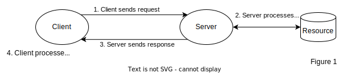
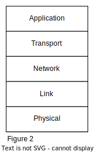
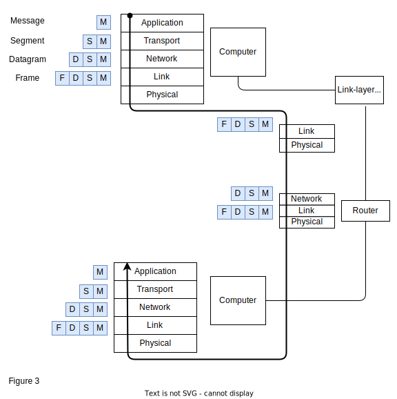
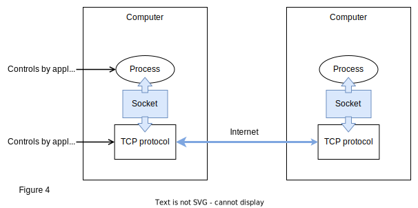
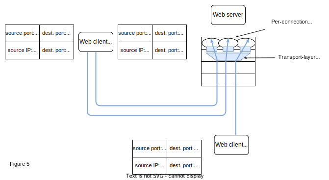

<h1> Basics of Computer Systems and Networking </h1>
This is necessary basic understanding of computer systems and networking to implement a basic web server using C/C++. This repository will not cover every single details about computer systems and networking but only at the surface-level as it will only convolute the repository away from the main objective of the repository. If you want to read more about these two topics, I really recommend checking out the Resources section.

 

- [Background](#background)
  - [Web server](#web-server)
  - [Networks](#networks)
    - [Five Layers Model](#five-layers-model)
    - [Encapsulation](#encapsulation)
    - [Application Layer - HTTP](#application-layer---http)
    - [Transport Layer - TCP](#transport-layer---tcp)
  - [Resources](#resources)
- [C/C++ Web Server Implementations](#cc-web-server-implementations)

 

# Background
The purpose of this project is for reinforcing my fundamental knowledge and understanding of web application, while also learning C++. Throughout this project, I will assume that you, the readers, have at least the basic knowledge or experience of developing a web application using at least high-level languages or frameworks like ExpressJs/NestJs (Javascript) or Django/Flask (Python). Although these frameworks and high-level languages allow for faster development, they abstracted many fundamental details of computer networking and systems. Therefore, this repository/project will serve as a starting point for my journey to understand web application as a whole.

<b>FYI:</b> If any of the information presented below is incorrect, please let me know through PR or issues. Thank you. 

## Web server
A web application is an application consist of one or many clients and a server. The application follows the client-server model. The server process manages some kind of resources that is used to process the requests made by its clients. The fundamental operation made in this model is a <i>transaction</i> as shown in Figure 1. This operation consists of four steps:

1. Client initiates a transaction by sending a request to the server (e.g. HTTP Requests).
2. Server receives the request and process it as necessary. (e.g. Client might request their user information, that is stored in the database that is accessible by the server).
3. Server replies back to the client with a response (e.g. HTTP Response).
4. The response could be in some kind of format that needs the client to process in order to use or understand it (e.g. HTTP response body could contain JSON with specific type or it could be a encoded string that needs decoding).

   

<b>FYI:</b> This is the most basic and simple model of web server. There are many other models that are extended from this model like microservice architecture or BFF models that are used for scaling web servers.

## Networks
Client and server communicate with each other through computer networ. Essentially, computer network is an interconnected system between computers and devices, exchanging data and resource. Computer network is a deep and extensive topic; therefore, to not convulate this repositorty/project about computer networking too much, our main focus will be on the implementations of the web server. The repository/project will only contain the minimal knowledge required to create a web server. However, if anyone wants to delve deeper into this topic, I really recommend reading ["Computer Networking: A Top-Down Approach 8th Edition" by Jim Kurose and Keith Ross](https://gaia.cs.umass.edu/kurose_ross/index.php).

### Five Layers Model
In computer networking, the format of the messages exchanged between hosts/devices is determined by a set of standardized protocols. For this project, the protocols will be based on the <b>five-layer protocols</b> mentioned in Jim Kurose and Keith Ross textbook (Figure 2). There is also the OSI model that splits the protocols in 7 layers; however, this project is based on Kurose and Rose model. The five-layers model splits and abstracts different aspects of networking into five layers. The top four layers each have different protocols on how the messages are formatted.

   

### Encapsulation
Hosts send messages to another by encapsulating their messages with each layer's protocol. Each protocol is used to maintain different aspects of computer networking. For example, the frame from link-layer or datagram from network-layer is used for routing the message to its destination, deciding how and where the datagrams/frames are routed. The transport layer protocol determines how segments (encapsulated application-layer message) are transported between two endpoints (how two sockets communicate with each other).

   

As shown in the figure above, the host (computer) sends a message by encapsulating its message with transport-layer, network-layer, and link-layer protocols. When arrived, the destination host decapsulates the frame into datagram, then passes the segment to the destined socket, which the socket decapsulates it into a message for the application to receive.

### Application Layer - HTTP
The layer that will be implemented and focused on in this project is the application layer protocol. Application layer controls the communication between two processes. The application layer protocol that is commonly used for transferring resources and data between web browser and server is the Hypertext Transfer Protocol (HTTP). We'll be implementing [HTTP/2](https://www.rfc-editor.org/rfc/rfc9113) and [HTTP/1.1](https://www.rfc-editor.org/rfc/rfc9110) that use the TCP/IP protocols (TCP for transport layer & IP for network layer).

   

As shown in figure 4, a socket is used to communicate between two processes. It is the interface between the application layer and the transport layer within a host. Many languages, including C++, provide API to access these socket interfaces, which is why we only have to program the application layer.

<b>FYI:</b> Different operating systems can use different socket API; therefore, it is possible that the web server is not runnable on your computer. For this project, we are developing it on MacOS, so we'll be using the POSIX socket from `sys/socket.h` file. For better understanding on different socket libaries, you can read it [here](https://stackoverflow.com/questions/28027937/cross-platform-sockets).

### Transport Layer - TCP
Unlike the application-layer protocol that sets how messages are understood between two processes, the transport-layer protocols provides the illusion that the hosts running the processes are connected and next to each other, while in reality, the hosts may possibly be on the opposites of the planet, worry free from the physical infrastucture of the connection and how the messages are sent.

Since we'll be implementing HTTP/2 and HTTP/1.1, we'll focus on Transmission Control Protocol (TCP) as both protocols use TCP for transport-layer. TCP is a connection-oriented protocol that provides reliable data transfer, meaning that the TCP will only allow two processes to transfer data if the connection is fully established and the data sent between two processes are ensured to be delivered.

   

As shown in figure 5, the TCP or transport-layer protocols handle <b>demultiplexing</b> (transportation of data segments to correct socket) and <b>multiplexing</b> (encapsulation of messages with headers to create segments) of messages. For TCP sockets, it is identified by using a four-tuple: source IP address, source port number, destination IP address, and destination port number. When a TCP segment arrives to the host, it uses the four-tuple to demultiplex the segment to the correct socket. 

For example, web client host A initiates two HTTP sessions to server B; therefore, it has two source port numbers for each connection. Furthermore, while host B have the same source port number as one of host A's HTTP session, it doesn't conflict with each other since source IP is different from each other.

<b> FYI: </b> TCP also uses the Internet Protocol (IP) for network-layer; however, we'll only talk about the HTTP and TCP for now since the implementations of the web server only require the knowledge of these two.

## Resources
- 

 

# C/C++ Web Server Implementations
